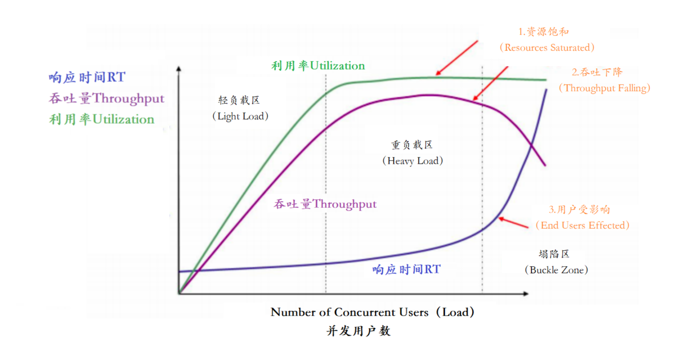
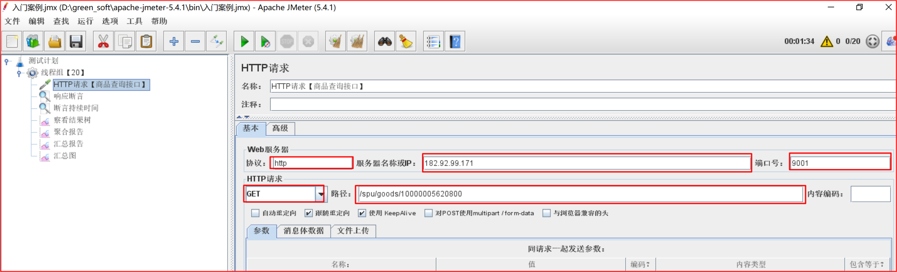
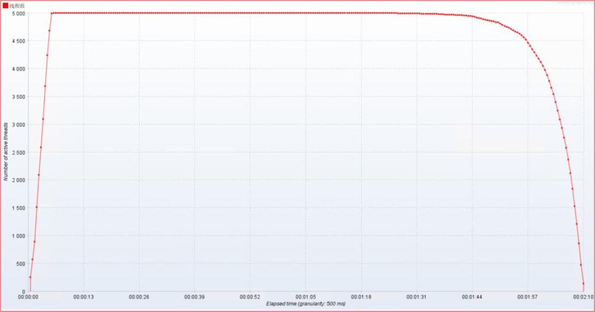
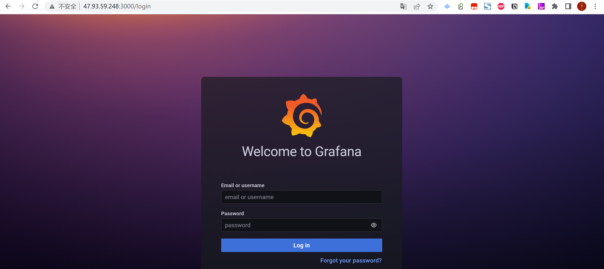
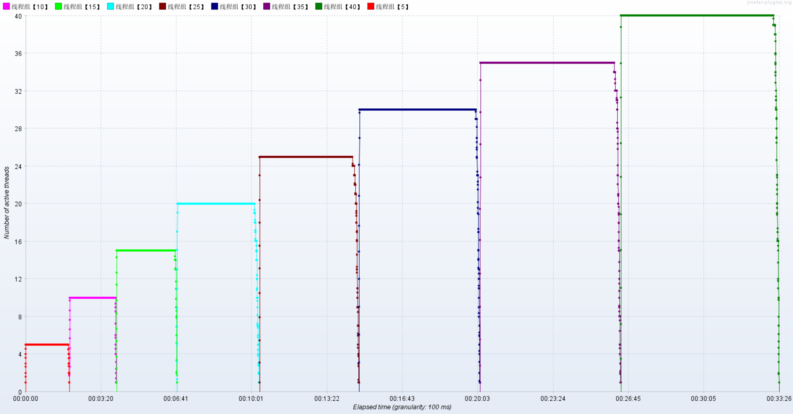
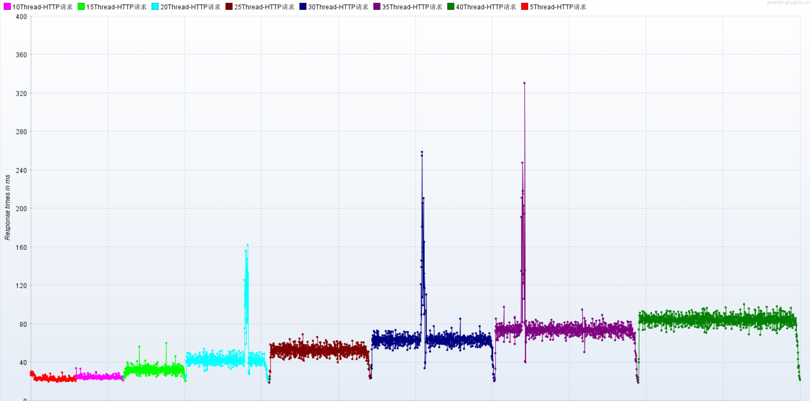

# 压力测试

## 1.主机环境


**阿里云：5台4C8G机器，4台压力机2C4G**
**服务器操作系统：CentOS 7.6    64位**
**服务器环境：1台压力机，1台应用服务主机，1台数据库与缓存服务器，1CICD服务器** 

- hero01：CICD服务器4C8G：Nginx、JMeter、CICD
  - 内网ip：172.17.187.81（I/O优化）25Mbps峰值 
- hero02：数据库与缓存服务器4C8G：MySQL、Redis、MQ、ES
  - 内网ip：172.17.187.78（I/O优化）25Mbps峰值
- hero03：应用服务器01-4C8G：Application
  - 内网ip：172.17.187.79（I/O优化）25Mbps峰值 
- hero04：监控服务器02-4C8G：Grafana、Prometheus、InfluxDB
  - 内网ip：172.17.187.80（I/O优化）25Mbps峰值

> 网络中的Mbps和MBps，及两者的换算关系 
>
> - Mbps = Megabit per second (Mbit/s or Mb/s) 
> - MBps = Megabyte per second
>   - 1 Mbps = 0.125 MB/s 
>   - 25Mbps = 3.125 MB/s

## 2 什么是压力测试？

**压力测试**（英语：Stress testing）是针对特定系统或是组件，为要确认其稳定性而特意进行的严格测 试。会让系统在超过正常使用条件下运作，然后再确认其结果。
压力测试是对系统不断施加压力，来预估系统服务能力的一种测试。

**为什么对系统压测呢？有没有必要。压不压测要看场景！**

- 一般而言，只有在系统基础功能测试验证完成、系统趋于稳定的情况下，才会进行压测。

**压测的目的是什么？**

1. 当负载逐渐增加时，观察系统各项性能指标的变化情况是否有异常
2. 发现系统的性能短板，进行针对性的性能优化
3. 判断系统在高并发情况下是否会报错，进程是否会挂掉
4. 测试在系统某个方面达到瓶颈时，粗略估计系统性能上限 
5. ....

**压测性能指标有哪些？**


以上主要的四种性能指标【**响应时间、并发用户数、吞吐量、资源使用率**】它们之间存在一定的相关性，共同反映出性能的不同方面。



在这个图中，定义了三条曲线、三个区域、两个点以及三个状态描述。

- 三条曲线：
  - 吞吐量的曲线（紫色）
  - 利用率（绿色）
  - 响应时间曲线（深蓝色）
- 三个区域：
  - 轻负载区（Light Load）
  - 重负载区（Heavy Load）
  - 塌陷区（Buckle Zone）
- 两个点：
  - 最优并发用户数（The Optimum Number of Concurrent Users） 
  - 最大并发用户数（The Maximum Number of Concurrent Users）
- 三个状态描述：
  - 资源饱和（Resource Saturated） 
  - 吞吐下降（Throughput Falling） 
  - 用户受影响（End Users Effected）


**常用压测工具：**

1. Apache JMeter : 可视化的测试工具
2. Apache的ab压力测试
3. Nginter 韩国研发
4. PAS 阿里测试工具
5. MeterSphere ：国内持续测试的开源平台
6. 等等


Apache JMeter是Apache组织开发的基于Java的压力测试工具。用于对软件做压力测试，它最初被设计 用于Web应用测试，但后来扩展到其他测试领域。 它可以用于测试**静态和动态资源**，例如**静态文件、 Java 小服务程序、CGI 脚本、Java 对象、数据库、FTP 服务器， 等等**。
官网地址：https://jmeter.apache.org/
中文社区：http://www.jmeter.com.cn/2747.html


**JMeter压测环境架构图**：


压测目标总的来说有4条：
1. **负载上升各项指标是否正常**
2. **发现性能短板**
3. **高并发下系统是否稳定**
4. **预估系统最大负载能力**


## 3 案例：SpringBoot项目不做任何配置，TPS上限是多少？

小问题：SpringBoot服务的TPS的理论的上线是多少？


### 3.1 手把手创建压测案例

**目标：完成压测案例，评测SpringBoot项目的吞吐量（TPS）上限**。


**步骤**：

1. 创建测试计划
2. 配置线程组、http请求、断言、结果监听器
3. 执行测试
4. 查看测试结果，分析测试结果


**实现**：

### 1）新建测试计划：


### 2）配置线程组：


线程属性说明：ramp-up背后含义不好理解，案例做完有详细解释

- 线程数：20，  线程数量，这里设置了20个线程
- ramp-up：表示在指定时间之内把这些线程全部启动起来。  如果n=1，那就表示要在1s以内把50个 线程全部启动起来。
- 循环次数：2000,表示把 20 thread 循环2000次，也就是说让每一个请求接口循环调用接口2000次

### 3）配置HTTP接口：

```http
http://47.95.217.81:9001/spu/goods/10000005620800
```



选择keepalive方式，表示使用了长连接。使用长连接可以防止频繁的建立连接，关闭连接消耗性能。一 般浏览器都支持keepalive，如果这里不勾选，这样我们的压测的部分性能消耗会发生在建立，关闭连接 上，导致我们的压测数据不准确。


### 4）配置断言：

JMeter断言常用有两种，一种是响应断言，一种是响应时间断言，如果响应内容不满足断言的配置，则 认为这次的请求是失败的。

响应断言：判断响应内容是否包含指定的字符信息，用于判断api接口返回内容是否正确。

响应时间断言：判断响应时间，是否超过预期的时间，用于判断api接口返回时间是否超过预期。 

断言添加方式：右击测试计划的http请求，选择添加-->断言-->**加响应断言和断言持续时间**。

（1）配置响应断言：我们接口正常返回code值为20001，如果接口返回code值不是20001表示接口异 常，为了测试，这里修改为接口返回code值不为20001则表示访问失败。


（2）配置断言响应时间：设置请求接口时间超过3毫秒，则认为请求失败。


（3）验证断言配置：发起http请求，由于返回内容code值不为20000，以及访问时间超过10毫秒，所 以认为访问失败。


### 5）配置结果监听：

配置监听器：监听压测结果【聚合报告和汇总结果很类似，看一个就行】

1. **聚合报告**：查询结果信息聚合汇总，例如样本、平均值、通吐量、最大值、最小值...
2. **察看结果树**：记录每一次压测请求
3. 图像结果：分析了所有请求的平均值、终止、偏离值和通吐量之间的关系。
4. 汇总结果：汇总压测结果
5. 汇总图：将压测结果以图像形式展示


## 3.2 压测结果

### 1）聚合报告：


- 样本（sample）: 发送请求的总样本数量
- 响应时间【单位ms】：
  - 平均值（average）：平均的响应时间
  - 中位数（median）: 中位数的响应时间，50%请求的响应时间
  - 90%百分位（90% Line）: 90%的请求的响应时间，意思就是说90%的请求是<=1765ms返 回，另外10%的请求是大于等于1765ms返回的。
  - 95%百分位（95% Line）: 95%的请求的响应时间，95%的请求都落在1920ms之内返回的 99%百分位（99% Line）: 99%的请求的响应时间
  - 最小值(min)：请求返回的最小时间，其中一个用时最少的请求
  - 最大值(max)：请求返回的最大时间，其中一个用时最大的请求
- 异常（error）: 出现错误的百分比，错误率=错误的请求的数量/请求的总数 
- 吞吐量TPS（throughout）: 吞吐能力
- Received KB/sec----每秒从服务器端接收到的数据量 
- Sent KB/sec----每秒从客户端发送的请求的数量

### 2）察看结果树：

记录了样本中的每一次请求


### 3）汇总图与图形结果

> 参考意义不大，且见文知意，所以略！

图形结果：分析了所有请求的平均值、终止、偏离值和通吐量之间的关系

- 横坐标：为请求数量，单位个数
- 纵坐标：响应时间，单位ms

### 4）汇总报告【类似于聚合报告】


- 样本（sample）: 发送请求的总样本数量
- 响应时间【单位ms】：
  - 平均值（average）：平均的响应时间
  - 最小值(min)：请求返回的最小时间，其中一个用时最少的请求
  - 最大值(max)：请求返回的最大时间，其中一个用时最大的请求
  - 标准偏差：度量响应时间分布的分散程度的标准，衡量响应时间值偏离平均响应时间的程度。 标准偏差越小，偏离越少，反之亦然。
- 异常（error）: 出现错误的百分比，错误率=错误的请求的数量/请求的总数 吞吐量TPS（throughout）: 吞吐能力，这个才是我们需要的并发数
- 每秒接收 KB/sec----每秒从服务器端接收到的数据量 
- 每秒发送KB/sec----每秒从客户端发送的请求的数量 
- 平均字节数

> 看到的是最终的结果数据！线性变化趋势！

## 3.3 线程组配置详解

- 01-线程数：用来发送http请求的线程的数量
  - 线程组常用来模拟一组用户访问系统资源（API接口）。
  - 假如客户机没有足够的能力来模拟较重的负载，可以使用JMeter的分布式测试功能，通过一 个JMeter的Master来远程控制多个JMeter的Salve完成测试。
- 02-循环次数：循环执行多少次操作
  - 循环次数表示了循环执行多少次操作！循环次数直接决定整个测试单个线程的执行时间，和整 体测试执行时间。
    - 单线程执行时间 = 单请求平均响应时间 * 循环次数
    - 整个测试耗时 = 单线程执行时间 +  (Ramp-Up  -  Ramp-Up / 线程数)
- 03-Ramp-Up：建立全部线程耗时
  - Ramp-Up Period (in-seconds) 代表隔多长时间执行，默认值是0，0代表同时并发。用于告知 JMeter 要在多长时间内建立全部的线程。

## 3.4 JMeter常用插件

**已有内容的分析维度不够：需要加入新的插件**

- TPS、QPS
- RT【平均响应时间】 
- 压力机活动线程数 
- 服务器资源信息
- ...

**开启插件下载**：

下载地址：http://jmeter-plugins.org/downloads/all/，官网上下载plugins-manager.jar直接在线下载, 然后执行在线下载即可。


在线下载方法如下图所示：


```tex
1、PerfMon：监控服务器硬件，如CPU，内存，硬盘读写速度等
Allows collecting target server resource metrics
2、Basic Graphs：主要显示平均响应时间，活动线程数，成功/失败交易数等    Average Response Time 平均响应时间
   Active Threads 活动线程数
   Successful/Failed Transactions 成功/失败    事务数
3、Additional Graphs：主要显示吞吐量，连接时间，每秒的点击数等
Response Codes
   Bytes Throughput
   Connect Times
   Latency
   Hits/s
```


### 01-配置插件

如果可以配置如下三个监听器，就表示插件已经安装成功！执行压力测试，就可以看见压测的每秒事务 数、响应时间，活动线程数等压测结果

- 响应时间：jp@gc - Response Times Over Time
- 活动线程数：jp@gc - Active Threads Over Time
- 每秒事务数：jp@gc - Transactions per Second


#### 响应时间：jp@gc - Response Times


#### 活动线程数：jp@gc - Active Threads



#### 每秒事务数：jp@gc - Transactions per Second


### 02-性能关键指标分析


#### 1）RT：响应时间

- 平均值：  请求响应的平均时间是332ms
- 中位数： 
- 50%请求响应时间都在8ms之内 
- P90： 90%的请求都在514ms之内响应结束 
- P95： 95%的请求都在1051ms之内响应结束 
- P99：99%的请求都在6979ms之内响应结束
- 最小值：  请求响应最小时间2ms
- 最大值：  请求响应的最大时间是35s

#### 2）压力机活动线程数

压力机活动线程数表明压测过程中施加的压力的情况

#### 3）TPS：  每秒的事务数

- 数字愈大，代表性能越好；

#### 4）QPS：  每秒的查询数量

- 数字愈大，代表性能越好；（1tps >= QPS）

#### 5）吞吐量：  每秒的请求数量

- 数字愈大，代表性能越好；

### 3.5 服务器硬件资源监控【精简版】

压测的时候，我们需要实时了解服务器【**CPU、内存、网络、服务器Load**】的状态如何，哪如何监控服 务器的资源占用情况呢？方法有很多种：

- 使用操作系统命令：top、vmstat、iostat、iotop、dstat、sar... 
- 使用finalshell
- **使用JMeter压测工具perfmon**
- **使用Grafana+Prometheus+node_exporter**

**监控原理**：


#### 01-配置服务端代理

注意：服务器硬件资源的监控，必须在服务端安装serverAgent代理服务，jmeter才能实现监控服务端 的cpu、内存、io的使用情况。
ServerAgent下载地址：https://github.com/undera/perfmon-agent/blob/master/README.md


```shell
## 默认启动运行    startAgent.sh 脚本即可
## 服务启动默认4444端口，根本连接不上，因此自己创建一个部署脚本文件对此进行部署，且把端口修 改为7879
nohup java -jar ./CMDRunner.jar --tool PerfMonAgent --udp-port 7879 --tcp- port 7879 > log.log 2>&1 &
## 赋予可执行权限
chmod 755 startAgent.sh
```

启用7879端口后，服务器的cpu，io，内存使用情况就顺利的监控到了。

#### 02-监控CPU

- Elapse time：消耗时间
- Performance Metrics：性能指标


- idle：CPU空闲
- iowait：IO等待
- system：系统占用
- CPU user：CPU用户占用

#### 03-监控网络：


- 接收字节：byteSrecv【单位：比特、KB、MB】 
- 发送字节：byteSent【单位：比特、KB、MB】
- 发送(transport)：tx
- 接收(receive)：rx

#### 04-监控内存：


- usedPerc：每分钟使用内存【单位：字节、KB、MB】 
- freePerc：每分钟未使用内存【单位：字节、KB、MB】

#### 05-监控系统整体负载情况：

服务器上执行以下命令：

```shell
#查询服务器资源使用情况
top
top -H
```

如下图所示，可以看到系统负载 load average 情况，1分钟平均负载，5分钟平均负载，15分钟平均负 载分别是 0.08, 0.03, 0.05 ；


统计信息区前五行是系统整体的统计信息：


#### 06-性能关键指标分析Load Average 

##### 1）服务器：CPU、内存、网络IO

CPU


内存


网络IO


##### 2）系统负载： load average

1. 什么是Load Average？

- 系统负载System Load是系统CPU繁忙程度的度量，即有多少进程在等待被CPU调度（进程等待队 列的长度）。
- 平均负载（Load Average）是一段时间内系统的平均负载，这个一段时间一般取1分钟、5分钟、 15分钟。
- 多核CPU和单核CPU的系统负载数据指标的理解还不一样。

> 维基百科定义：In Unix computing, the system load is ameasure of the amount of computational work that a computer system performs.
> 在类Unix系统中，系统负载是衡量计算机系统执行的计算工作量的指标。

举个栗子：while(true) 这样程序不耗时，cpu会飙高，但是load average不会走高。说明程序在计算， 但是并没有执行耗时工作，所以Load Average并不高。我们在核查服务器负载因需要重点关注load average。

2. Load的数值是什么含义？

不同的CPU性质不同：单核，双核，四核 -->>

**单核CPU三种Load情况**

举例说明：把CPU比喻成一条（单核）马路，进程任务比喻成马路上跑着的汽车，Load则表示马 路的繁忙程度。

- 情况1-Load小于1：不堵车，汽车在马路上跑得游刃有余：

  

- 情况2-Load等于1：马路已无额外的资源跑更多的汽车了：

  

- 情况3-Load大于1：汽车都堵着等待进入马路：

  

**双核CPU**

- 如果有两个CPU，则表示有两条马路，此时即使Load大于1也不代表有汽车在等待：

  

- [Load==2，双核，没有等待]

3. 什么样的Load值得警惕？

如下分析针对单核CPU

- 【0.0 - 0.7]】    ：系统很闲，马路上没什么车，要考虑多部署一些服务
- 【0.7 - 1.0 】：系统状态不错，马路可以轻松应对
- 【等于1.0】  ：系统马上要处理不多来了，赶紧找一下原因
- 【大于5.0】  ：马路已经非常繁忙了，进入马路的每辆汽车都要无法很快的运行

4. 不同Load值说明什么问题？

如下分析针对单核CPU的四种情况：

**情况1：1分钟负载 > 5，5分钟负载 < 1，15分钟负载 < 1**

- 举例： 5.18 , 0.05 , 0.03
- 短期内繁忙，中长期空闲，初步判断是一个“抖动”或者是“拥塞前兆”

**情况2：1分钟负载 > 5，5分钟负载 > 1，15分钟负载 < 1**

- 举例： 5.18 , 1.05 , 0.03
- 短期内繁忙，中期内紧张，很可能是一个“拥塞的开始” 

**情况3：1分钟负载 > 5，5分钟负载 > 5，15分钟负载 > 5**

- 举例： 5.18 , 5.05 , 5.03
- 短中长期都繁忙，系统“正在拥塞”

**情况4：1分钟负载 < 1，5分钟负载 > 1，15分钟负载 > 5**

- 举例： 0.18 , 1.05 , 5.03

- 短期内空闲，中长期繁忙，不用紧张，系统“拥塞正在好转”

  

## 4 压测监控平台


> Docker+JMeter+InfluxDB+Grafana+node_exporter

开始时，在阿里云配置四台4C8G按量计费的服务器。注意：用完记得释放资源，免得一直计费！  

### 4.1 配置Docker环境

1）yum 包更新到最新

```shell
sudo yum update -y
```

2）安装需要的软件包， yum-util 提供yum-config-manager功能，另外两个是devicemapper驱动依赖的

```shell
sudo yum install -y yum-utils device-mapper-persistent-data lvm2
```

3）设置yum源为阿里云

配置yum源的代理，类似于maven镜像仓库，加速下载软件。

```
sudo yum-config-manager --add-repo http://mirrors.aliyun.com/docker- ce/linux/centos/docker-ce.repo
```

4）安装docker

```shell
sudo yum install docker-ce -y
# 启动
systemctl start docker
```

5）安装后查看docker版本

```dockerfile
docker -v
```

### 4.2 安装InfluxDB

1）下载InfluxDB的镜像：

```
docker pull influxdb:1.8
```

2）启动InfluxDB的容器，并将端口 8083 和 8086 映射出来：

```
docker run -d --name influxdb -p 8086:8086 -p 8083:8083 influxdb:1.8
```

3）进入容器内部，创建名为jmeter的数据库：

进入 jmeter-influx 容器

```
docker exec -it influxdb /bin/bash
```

- 输入 influx 命令，即可进入 influx 操作界面
- 输入 create database jmeter 命令，创建名为 jmeter 的数据库 
- 输入 show databases 命令，查看数据库创建成功

```
root@517f57017d99:/# influx
Connected to http://localhost:8086 version 1.7.10
InfluxDB shell version: 1.7.10
> create database jmeter
> show databases
```

4）使用JMeter 库， select 查看数据，这个时候是没有数据的： 

- 输入 use jmeter 命令，应用刚才创建的数据库
- 输入 select * from jmeter 命令，查询库中有哪些数据

```
> use jmeter
> select * from jmeter
```

### 4.3 设置JMeter脚本后置监听器

#### 1）配置后置监听器

想要将 JMeter的测试数据导入 InfluxDB ，就需要在 JMeter中使用 Backend Listener 配置


#### 2）主要配置说明

implementation 选择 InfluxDB所对应的：


- influxdbUrl：需要改为自己influxdb的部署ip和映射端口，我这里是部署在阿里云服务器，所以就 是47.93.59.248，口是容器启动时映射的8086端口，db后面跟的是刚才创建的数据库名称
- application：可根据需要自由定义，只是注意后面在 grafana 中选对即可
- measurement：表名，默认是 jmeter ，也可以自定义
- summaryOnly：选择true的话就只有总体的数据。false会记录总体数据，然后再将每个 transaction都分别记录
- samplersRegex：样本正则表达式，将匹配的样本发送到数据库
- percentiles：响应时间的百分位P90、P95、P99
- testTitle：events表中的text字段的内容
- eventTags：任务标签，配合Grafana一起使用

> 注意：云服务器配置开启端口8086

```
influxdbMetricsSender
org.apache.jmeter.visualizers.backend.influxdb.HttpMetricsSender influxdbUrl http://47.93.59.248:8086/write?db=jmeter
application hero_mall_one
measurement jmeter
summaryOnly false
samplersRegex   RT*
percentiles 90;95;99
testTitle   压力测试案例01
eventTags
```

#### 3）运行验证

运行Jmeter 脚本，然后再次在 influxdb 中查看数据，发现类似下面的数据说明输入导入成功：


### 4.4 安装Grafana

#### 1）下载Grafana镜像：

```
docker pull grafana/grafana
```

#### 2）启动Grafana容器：

启动Grafana容器，将3000端口映射出来

```
docker run -d --name grafana -p 3000:3000 grafana/grafana
```

#### 3）验证部署成功

网页端访问http://101.200.146.199:3000验证部署成功



默认账户密码：admin\admin

#### 4）选择添加数据源


#### 5）找到并选择 influxdb :


#### 6）配置数据源


数据源创建成功时会有绿色的提示：


#### 7）导入模板


模板导入分别有以下3种方式： 

- 直接输入模板id号
- 直接上传模板json文件 
- 直接输入模板json内容


#### 8）找展示模板

在Grafana的官网找到我们需要的展示模板

- Apache JMeter Dashboard
  - dashboad-ID：5496
- JMeter Dashboard(3.2 and up)
  - dashboad-ID：3351

#### 9）导入找到的模板，使用模板id

导入模板，我这里选择输入模板id号，导入后如下，配置好模板名称和对应的数据源，然后 import 即可


#### 10）查看效果

展示设置，首先选择创建的application


注意：  如果我们修改过表名，也就是在jmeter的Backend Listener的measurement配置(默认为 jmeter)，这个时候就需要去设置中进行修改，我这里使用的就是默认的，所以无需修改。

### 4.5 安装node_exporter

```
# 下载
wget -c
https://github.com/prometheus/node_exporter/releases/download/v0.18.1/node_ex porter-0.18.1.linux-amd64.tar.gz
# 解压
mkdir /usr/local/hero/
tar zxvf node_exporter-0.18.1.linux-amd64.tar.gz -C /usr/local/hero/
# 启动
cd /usr/local/hero/node_exporter-0.18.1.linux-amd64 nohup ./node_exporter > node.log 2>&1 &
```

注意：在被监控服务器中配置开启端口9100
http：//101.200.87.86:9100/metrics


### 4.6 安装Prometheus

#### 1）下载解压运行

```
# 下载
wget -c
https://github.com/prometheus/prometheus/releases/download/v2.15.1/prometheus -2.15.1.linux-amd64.tar.gz
# 解压
tar zxvf prometheus-2.15.1.linux-amd64.tar.gz -C /usr/local/hero/ cd /usr/local/hero/prometheus-2.15.1.linux-amd64
# 运行
nohup ./prometheus > prometheus.log 2>&1 &
```

#### 2）配置prometheus

在prometheus.yml中加入如下配置：

```yaml
- job_name: 'hero-Linux'
   static_configs:
   - targets:
['172.17.187.78:9100','172.17.187.79:9100','172.17.187.81:9100']
```

#### 3）测试Prometheus

测试Prometheus是否安装配置成功

http://101.200.146.199:9090/targets


#### 3）在Grafana中配置Prometheus的数据源:


#### 4）Grafana导入Linux展示模板

导入Linux系统dashboard

- Node Exporter for Prometheus Dashboard EN 20201010 
  - dashboard-ID: 11074
- Node Exporter Dashboard 
  - dashboard-ID: 16098


### 4.7 梯度压测：分析接口性能瓶颈

以上主要的四种性能指标【**响应时间、并发用户数、吞吐量、资源使用率**】它们之间存在一定的相关 性，共同反映出性能的不同方面。


压测接口：响应时间20ms，响应数据包3.8kb，请求数据包0.421kb

```
http://59.110.66.2:9001/spu/goods/10000005620800
```

#### 4.7.1 压测配置：

**情况01-模拟低延时场景**，用户访问接口并发逐渐增加的过程。

预计接口的响应时间为20ms

- 线程梯度：5、10、15、20、25、30、35、40个线程
- 循环请求次数5000次
- 时间设置：Ramp-up period(inseconds)的值设为对应线程数 测试总时长：约等于20ms x 5000次 x 8 = 800s = 13分
- 配置断言：超过3s，响应状态码不为20000，则为无效请求  

#### 4.7.2 机器环境

- 应用服务器配置：4C8G
  - 外网-网络带宽25Mbps （峰值） 
  - 内网-网络带宽基础1.5/最高10Gbit/s
- 集群规模：单节点
- 服务版本：v1.0
- 数据库服务器配置：4C8G

```
Mbps : Megabit per second (Mbit/s or Mb/s)
MB/s : Megabyte per second
1 byte = 8 bits
1 bit  = (1/8) bytes
1 bit  = 0.125 bytes
1 megabyte = 10002 bytes
1 megabit  = 10002 bits
1 megabit  = 0.125 megabytes
1 megabit/second = 0.125 megabytes/second
1 Mbps = 0.125 MB/s
```

> 结论：
>
> - 1 Gbit/s = 1 Gbps = 125 MB/s 
> - 1 Mbps = 0.125 MB/s

#### 4.7.3 配置监听器：

1. 聚合报告：添加聚合报告

2. 查看结果树：添加查看结果树

3. 活动线程数：压力机中活动的线程数

4. TPS统计分析：每秒事务树

5. RT统计分析：响应时间

6. 后置监听器，将压测信息汇总到InfluxDB，在Grafana中呈现

7. 压测监控平台：

  - JMeter DashBoard

  - 应用服务器：内存、网络、磁盘、系统负载情况

  - MySQL服务器：内存、网络、磁盘、系统负载情况

#### 4.7.4 性能瓶颈剖析

##### 1）梯度压测，测出瓶颈

进一步提升压力，发现性能瓶颈

- 使用线程：5，然后循环5000次，共2.5万个样本
- 使用线程：10，然后循环5000次，共5万个样本
- 使用线程：15，然后循环5000次，共7.5万个样本
- 使用线程：20，然后循环5000次，共10万个样本
- 使用线程：25，然后循环5000次，共12.5万个样本
- 使用线程：30，然后循环5000次，共15万个样本
- 使用线程：35，然后循环5000次，共17.5万个样本
- 使用线程：40，然后循环5000次，共20万个样本

聚合报告


Active Threads



RT



TPS


压测监控平台与JMeter压测结果一致


压测中服务器监控指标


##### 2）问题1：网络到达瓶颈

> 注意：系统网络带宽为25Mbps


**结论**：随着压力的上升，TPS不再增加，接口响应时间逐渐在增加，偶尔出现异常，瓶颈凸显。系统的 负载不高。CPU、内存正常，说明系统这部分资源利用率不高。带宽带宽显然已经触顶了。

**优化方案**：

- 方案01-降低接口响应数据包大小

  - 返回数据量小的接口，响应数据包0.6kb，请求数据包0.421kb

    ```
    http://59.110.66.2:9001/spu/goods/10000023827800
    ```

- 方案02-提升带宽【或者在内网压测】

  - 25Mbps --> 100Mbps

  - 云服务器内网：这里在Linux中执行JMeter压测脚本

    ```
    jmeter -n -t 02-jmeter-example.jmx -l 02-jmeter-example.jtl
    ```

**优化之后**：

方案01-降低接口响应数据包大小，压测结果


方案02-提升带宽【或者在内网压测】，压测结果

> 自己尝试

问题：可不可以基于RT与TPS算出服务端并发线程数？

> 服务端线程数计算公式：TPS/ (1000ms/ RT均值)
>
> - RT=21ms，TPS=800，服务端线程数：= 800/ (1000ms/ RT均值) = 17
> - RT=500ms，TPS=800，服务端线程数：= 800/ (1000ms/ RT均值) = 400
> - RT=1000ms，TPS=800，服务端线程数：= 800/ (1000ms/ RT均值) = 800

**结论**：

- 在低延时场景下，服务瓶颈主要在服务器带宽。
- TPS数量等于服务端线程数  乘以  (1000ms/ RT均值)
- RT=21ms，TPS=800，服务端线程数：= 800/ (1000ms/ RT均值) = 17

##### 3）问题2：接口的响应时间是否正常？是不是所有的接口响应都可以这么快？

**情况02-模拟高延时场景**，用户访问接口并发逐渐增加的过程。接口的响应时间为500ms

- 线程梯度：100、200、300、400、500、600、700、800个线程;
- 循环请求次数200次
- 时间设置：Ramp-up period(inseconds)的值设为对应线程数的1/10； 测试总时长：约等于500ms x 200次 x 8 = 800s = 13分
- 配置断言：超过3s，响应状态码不为20000，则为无效请求

```java
//慢接口
@GetMapping("/goods/slow/{spuId}")
public Result findGoodsBySpuIdTwo(@PathVariable String spuId){    Goods goods = spuService.findBySpuId(spuId);
   //模拟慢接口
   try {
       //休眠500ms
       TimeUnit.MILLISECONDS.sleep(500);
   } catch (InterruptedException e) {
       e.printStackTrace();
 }
   return new Result(true, StatusCode.OK, "查询成功", goods);
}
```

响应慢接口：500ms+，响应数据包3.8kb，请求数据包0.421kb

```
http://59.110.66.2:9001/spu/goods/slow/10000005620800
```

**测试结果：RT、TPS、网络IO、CPU、内存、磁盘IO**


**结论**：

- 在高延时场景下，服务瓶颈主要在容器最大并发线程数。 
- RT=500ms，TPS=800，服务端线程数：= 800/ (1000ms/ RT) = 400
  - Tomcat默认的最大的线程数？200
- 观察服务容器最大线程数，发现处理能力瓶颈卡在容器端

##### 4）问题3：TPS在上升到一定的值之后，异常率较高

- 可以理解为与IO模型有关系，因为当前使用的是阻塞式IO模型。这个问题我们在服务容器优化部分 解决。
- 彻底理解这个问题，需要学完并发编程与网络编程