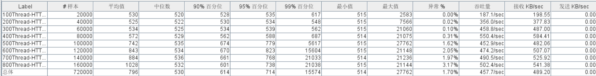

# 服务容器优化

## 1. Tomcat调优

为什么对SpringBoot嵌入式的Web服务器Tomcat进行调优？

- 基于梯度压测分析瓶颈得出结论：当接口响应时间比较长时，性能瓶颈主要卡在Web服务器中
- Tomcat三大配置maxThreads、acceptCount、maxConnections

1）最大线程数maxThreads

- 决定了Web服务器最大同时可以处理多少个请求任务数量
- 线程池最大线程数，默认值200

2）最大等待数accept-count

- 当调用HTTP请求数达到Tomcat的最大线程数时，还有新的请求进来，这时Tomcat会将该剩余请 求放到等待队列中
- acceptCount就是指队列能够接受的最大的等待连接数
- 默认值是100，如果等待队列超了，新的请求会被拒绝（connection refused）

3）最大连接数MaxConnections

- 最大连接数是指在同一时间内，Tomcat能够接受的最大连接数。如果设置为-1，则表示不限制 
- 默认值：
  - 对BIO模式，默认值是Max Threads；如果使用定制的Executor执行器，哪默认值将是执行器 中Max Threads的值。
  - 对NIO模式，Max Connections 默认值是10000
- Max Connections和accept-count关系：
  - 当连接数达到最大值Max Connections后系统会继续接收连接，但不会超过acceptCount限制


**最大线程数并不是越大越好**

- 最大线程数只是TPS的影响因素之一
- 增加线程是有成本的，不能无限制增大，创建线程需要消耗内存（Xss=1m）
- 线程过多会带来频繁的线程上下文切换，什么是线程上下文切换呢？

**最大线程数的值应该设置多少合适呢？**

- 需要基于业务系统的监控结果来定：RT均值很低不用设置，RT均值很高考虑加线程数
- 接口响应时间低于100毫秒，足以产生足够的TPS
- 如果没有证据表明系统瓶颈是线程数，则不建议设置最大线程数
- 个人经验值：1C2G线程数200，4C8G线程数800


问题：可不可以基于RT与TPS算出服务端并发线程数？

> 服务端线程数计算公式：TPS/ (1000ms/ RT均值)

### 1.1 调优：嵌入式Tomcat配置

Springboot开发的服务使用嵌入式的Tomcat服务器，那么Tomcat配置使用的是默认配置，我们需要对 Tomcat配置进行适当的优化，让Tomcat性能大幅提升。


修改配置如下所示：可以使用外挂配置，也可以修改配置文件application.yml。


### 1.2 调优配置生效确认


### 1.3 调优前后的性能对比

调优前：压力机Active，RT、TPS、系统进程运行状态【应用活动线程数】


调优后：压力机Active，RT、TPS、系统进程运行状态【应用活动线程数】




结论：提升Tomcat最大线程数，在高负载场景下，TPS提升接近1倍，同时RT大幅降低；

## 2. 网络IO模型调优

### 2.1 IO模型介绍


众所周知文件读写性能是影响应用程序性能的关键因素之一。NIO与原来的IO有同样的作用和目的，但 是使用的方式完全不同，NIO支持面向缓冲区的、基于通道的IO操作。NIO以更加高效的方式进行文件 的读写操作。

Java的NIO【new io】是从Java 1.4版本开始引入的一套新的IO API用于替代标准的Java IO API。

JDK1.7之后，Java对NIO再次进行了极大的改进，增强了对文件处理和文件系统特性的支持。我们称之 为AIO，也可以叫NIO2。

**优化：使用NIO2的Http协议实现，对请求连接器进行改写。**

**结论：可以发现服务响应时间大幅缩短，并且稳定**

```java
@Configuration
public class TomcatConfig {
   //自定义SpringBoot嵌入式Tomcat
   @Bean
   public TomcatServletWebServerFactory servletContainer() {
       TomcatServletWebServerFactory tomcat = new TomcatServletWebServerFactory() {};
    
       tomcat.addAdditionalTomcatConnectors(http11Nio2Connector());
       return tomcat;
 }
 
   //配置连接器nio2
   public Connector http11Nio2Connector() {
       Connector connector=new
Connector("org.apache.coyote.http11.Http11Nio2Protocol");
       Http11Nio2Protocol nio2Protocol = (Http11Nio2Protocol)
connector.getProtocolHandler();
       //等待队列最多允许1000个线程在队列中等待
       nio2Protocol.setAcceptCount(1000);
       // 设置最大线程数
       nio2Protocol.setMaxThreads(1000);
       // 设置最大连接数
       nio2Protocol.setMaxConnections(20000);
       //定制化keepalivetimeout,设置30秒内没有请求则服务端自动断开keepalive链接        nio2Protocol.setKeepAliveTimeout(30000);
       //当客户端发送超过10000个请求则自动断开keepalive链接
       nio2Protocol.setMaxKeepAliveRequests(10000);
       // 请求方式
       connector.setScheme("http");
       connector.setPort(9003);                    //自定义的端口，与源端口9001 可以共用，知识改了连接器而已
       connector.setRedirectPort(8443);
       return connector;
 }
}
```

### 2.2 调优前后的性能对比

#### **调优前：RT、TPS**


#### **调优后：RT、TPS**


**小结：将NIO升级为AIO之后，RT的毛刺大幅降低，异常数（超时3s）几乎为0。**

## 3. 容器优化Tomcat升级Undertow

```sh
https://undertow.io/
```

Undertow是一个用Java编写的灵活的高性能Web服务器，提供基于NIO的阻塞和非阻塞API。

- 支持Http协议
- 支持Http2协议
- 支持Web Socket
- 最高支持到Servlet4.0
- 支持嵌入式

SpringBoot的web环境中默认使用Tomcat作为内置服务器，其实SpringBoot提供了另外2种内置的服务 器供我们选择，我们可以很方便的进行切换。

- Undertow红帽公司开发的一款基于 **NIO 的高性能 Web 嵌入式服务器** 。轻量级Servlet服务器， 比Tomcat更轻量级没有可视化操作界面，没有其他的类似jsp的功能，只专注于服务器部署，因此 undertow服务器性能略好于Tomcat服务器；
- Jetty开源的Servlet容器，它是Java的web容器。为JSP和servlet提供运行环境。Jetty也是使用Java 语言编写的。

### 3.1 配置操作过程：

1. 在spring-boot-starter-web排除tomcat

```xml
<dependency>
   <groupId>org.springframework.boot</groupId>
   <artifactId>spring-boot-starter-web</artifactId>
   <exclusions>
       <exclusion>
           <groupId>org.springframework.boot</groupId>
           <artifactId>spring-boot-starter-tomcat</artifactId>        </exclusion>
   </exclusions>
</dependency>
```

2. 导入其他容器的starter

```xml
<!--导入undertow容器依赖-->
<dependency>
   <groupId>org.springframework.boot</groupId>
   <artifactId>spring-boot-starter-undertow</artifactId>
</dependency>
```

3. 配置

```yaml
# 设置IO线程数, 它主要执行非阻塞的任务,它们会负责多个连接
server.undertow.threads.io: 800
# 阻塞任务线程池, 当执行类似servlet请求阻塞IO操作, undertow会从这个线程池中取得线程
# 默认值是IO线程数*8
server.undertow.threads.worker: 8000
# 以下的配置会影响buffer,这些buffer会用于服务器连接的IO操作,有点类似netty的池化内存管理
# 每块buffer的空间大小越小，空间就被利用的越充分，不要设置太大，以免影响其他应用，合适即可
server.undertow.buffer-size: 1024
# 每个区分配的buffer数量    , 所以pool的大小是buffer-size * buffers-per-region
# 是否分配的直接内存(NIO直接分配的堆外内存)
server.undertow.direct-buffers: true
```

4. 压测

### 3.2 调优前后的性能对比

#### 调优前：RT、TPS【这个是没有进行NIO2优化的Tomcat】


#### 调优后：RT、TPS


**小结**：

- 更换了服务容器之后，RT更加平稳，TPS的增长趋势更平稳，异常数（超时3s）几乎为0。
- 在低延时情况下，接口通吐量不及Tomcat。
- 稳定压倒一切，如果只是写json接口，且对接口响应稳定性要求高，可以选用Undertow

**还有很多可以优化的空间就不一一举例**，这里我们更多的是教大家分析应用性能问题的方法，最直观的 感受应用性能到底卡在什么地方。虽然算不上很全面，但是作为高级开发工程师，到这个程度就够了。 其他可以优化的地方：

- ARP-IO模型
- Jetty 容器
- KeepAliveTimeout【默认】 
- MaxKeepAliveRequests
- ...